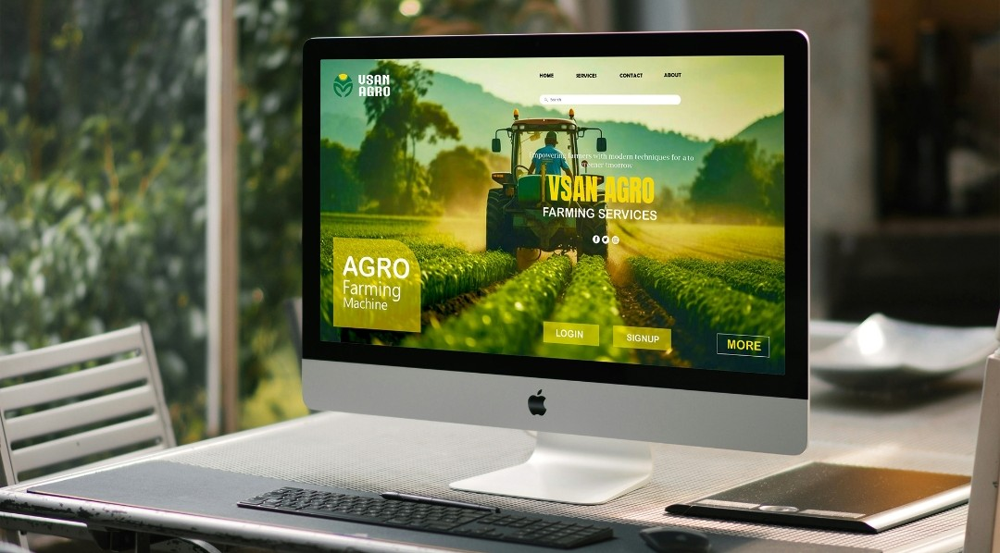
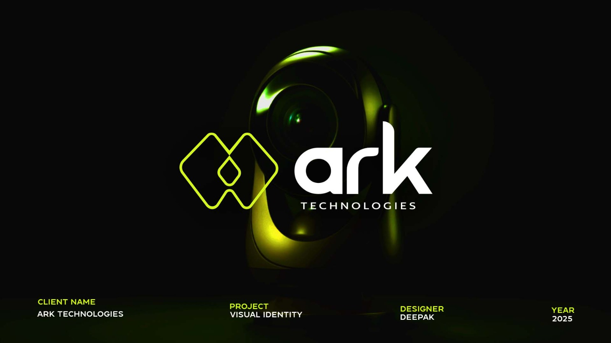
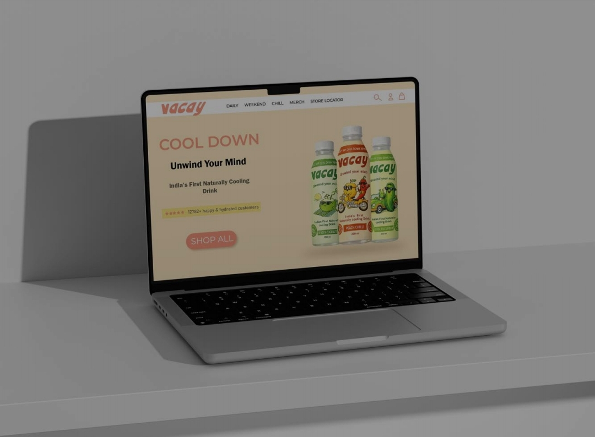

# Graphoria – Startup Design Studio Website

## 🌐 Live Demo
[View Live Project](https://graphoria.onrender.com/)

Graphoria is a digital design studio platform focused on creating modern, high-quality web experiences. This project is part of an ongoing startup initiative.

##  Tech Stack
- Frontend: React, TypeScript, Tailwind CSS
- Backend: Spring Boot (Java)
- Database: PostgreSQL

##  Features
- Responsive and modern UI design
- Portfolio showcase with category filtering
- Contact form with backend integration
- PDF generation for user inquiries

## 📸 Screenshots

### Home Page

  

### Our Work Section

  

### Contact Page

  

##  My Contribution
- Designed and developed the frontend using React and Tailwind CSS
- Built reusable UI components and ensured responsiveness
- Integrated frontend with backend APIs
- Contributed to backend development using Spring Boot

##  Status
Currently under active development as part of a startup project.
